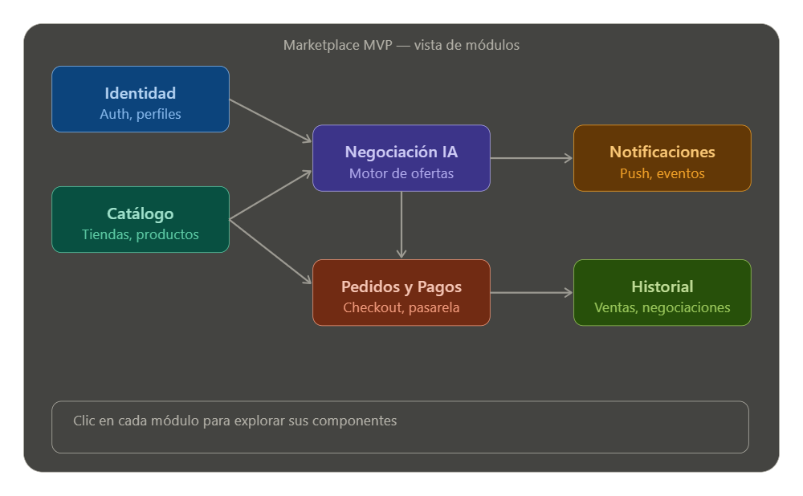
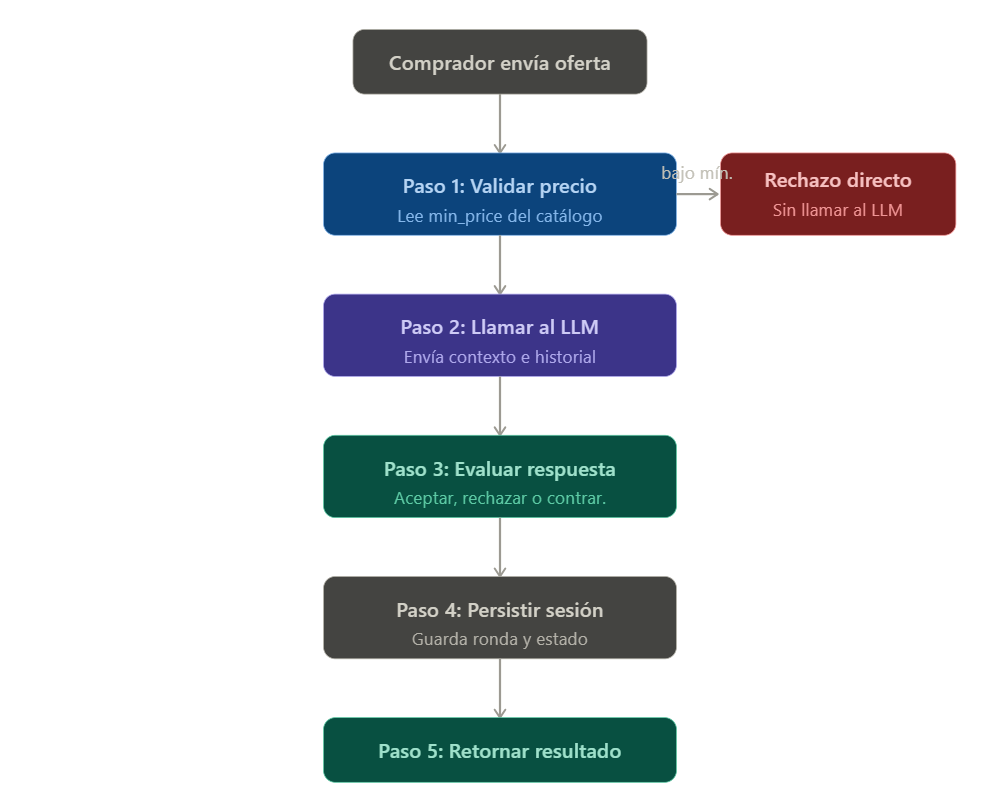

# SWNT-Laboratorio-2-Especificaciones-de-la-App

## Nicolás Toro Criollo

---

**Prompt:**

Actúa como Product Owner de una aplicación de marketplace para pequeños comercios en Colombia que incluye negociación de precios con inteligencia artificial.
Genera entre 5 y 7 historias de usuario para el MVP del sistema.
Cada historia debe seguir el formato estándar:
Como [tipo de usuario]
Quiero [acción o funcionalidad]
Para poder [beneficio o valor]
Condiciones:
* Deben estar relacionadas con la negociación de precios, compra de productos y gestión de comercios.
* Deben ser funcionalidades realistas para un MVP.
* Numéralas como HU-01, HU-02, etc.
* Mantén cada historia en máximo 2 líneas.

**Respuesta:**

Aquí están las historias de usuario para el MVP de tu marketplace:

## Negociación con IA

**Comprador**
HU-01
Como comprador, quiero iniciar una negociación de precio con un asistente de IA sobre un producto listado, para poder obtener un precio ajustado a mi presupuesto sin negociar directamente con el vendedor.

**Vendedor**
HU-02
Como vendedor, quiero configurar un rango de precio mínimo aceptable para que la IA negocie en mi nombre, para poder recibir ofertas automáticamente aprobadas sin intervenir en cada transacción.

## Gestión de productos y comercio
**Vendedor**
HU-03
Como dueño de pequeño comercio, quiero registrar mi tienda y publicar productos con foto, descripción y precio base, para poder tener presencia digital y comenzar a recibir pedidos en línea.

**Comprador**
HU-04
Como comprador, quiero buscar y filtrar productos por categoría, precio y ubicación del comercio, para poder encontrar rápidamente lo que necesito cerca de mí.
Compra y pedidos

**Comprador**
HU-05
Como comprador, quiero confirmar y pagar un pedido con el precio negociado directamente en la plataforma, para poder completar la compra de forma segura y sin salir de la aplicación.

**Vendedor**
HU-06
Como vendedor, quiero recibir notificaciones de nuevos pedidos y ver el historial de ventas en un panel simple, para poder gestionar mis órdenes y hacer seguimiento de mis ingresos fácilmente.

**Comprador**
HU-07
Como comprador frecuente, quiero ver el historial de precios negociados en pedidos anteriores, para poder tomar decisiones informadas al comparar ofertas en futuras compras.

Aquí está el resumen del backlog MVP con 7 historias organizadas en tres bloques:

**Negociación con IA (HU-01, HU-02):** el núcleo diferencial del producto. El comprador negocia con la IA y el vendedor define sus límites de precio de forma pasiva. Esto elimina la fricción humana en cada transacción.

**Gestión de comercio y descubrimiento (HU-03, HU-04):** funcionalidades básicas de oferta y demanda. Sin ellas no hay marketplace.

**Compra y seguimiento (HU-05, HU-06, HU-07):** cierre del ciclo: pago, notificación al vendedor e historial para el comprador. Lo mínimo para que una transacción real ocurra de extremo a extremo.

Como siguiente paso, podría ayudarte a definir los **criterios de aceptación** de alguna historia específica, o a crear el **mapa de épicas** para priorizar el orden de desarrollo. ¿Te interesa?

---

**Prompt:**
Actúa como arquitecto de software especializado en diseño de MVPs para marketplaces.
Tengo las siguientes historias de usuario para una aplicación de marketplace con negociación de precios mediante IA para pequeños comercios:
HU-01 Como comprador, quiero iniciar una negociación de precio con un asistente de IA sobre un producto listado para obtener un precio ajustado a mi presupuesto. HU-02 Como vendedor, quiero configurar un rango de precio mínimo aceptable para que la IA negocie en mi nombre. HU-03 Como dueño de pequeño comercio, quiero registrar mi tienda y publicar productos con foto, descripción y precio base. HU-04 Como comprador, quiero buscar y filtrar productos por categoría, precio y ubicación del comercio. HU-05 Como comprador, quiero confirmar y pagar un pedido con el precio negociado directamente en la plataforma. HU-06 Como vendedor, quiero recibir notificaciones de nuevos pedidos y ver el historial de ventas. HU-07 Como comprador frecuente, quiero ver el historial de precios negociados en pedidos anteriores.
Tu tarea es proponer la arquitectura inicial del sistema.
Genera un Mapa de Componentes v1 con la siguiente estructura:
1. Módulos principales (entre 3 y 6 módulos)
2. Componentes por módulo (entre 2 y 5 componentes cada uno)
Clasifica cada componente como:
* UI
* Servicio
* Datos
* Integración
1. Dependencias entre componentes Ejemplo: Formulario Login → Servicio de Autenticación
2. Separa claramente:
* Componentes esenciales para el MVP
* Componentes para futuras versiones
Presenta el resultado en Markdown estructurado.

**Respuesta:**

Aquí está el Mapa de Componentes v1 completo.

Primero, el diagrama estructural con la vista de módulos y sus relaciones de alto nivel:



Ahora el detalle completo del mapa en formato estructurado:

---

## Mapa de Componentes v1 — Marketplace con negociación IA

---

### M1 · Identidad y Acceso

**Clasificación:** esencial para MVP

| Componente | Tipo | Descripción |
|---|---|---|
| Formulario de registro/login | UI | Pantallas de acceso para comprador y vendedor |
| Servicio de autenticación | Servicio | JWT, sesiones, roles (buyer / seller) |
| Repositorio de usuarios | Datos | Tabla `users` con rol, perfil y estado |

**Dependencias:** Formulario login → Servicio de autenticación → Repositorio de usuarios

---

### M2 · Catálogo de Comercios y Productos

**Clasificación:** esencial para MVP

| Componente | Tipo | Descripción |
|---|---|---|
| Panel de gestión de tienda | UI | Alta de tienda, logo, ubicación (HU-03) |
| Formulario de producto | UI | Foto, descripción, precio base, precio mínimo (HU-02, HU-03) |
| Servicio de catálogo | Servicio | CRUD de tiendas y productos, validaciones |
| Repositorio de productos | Datos | Tablas `stores`, `products` con precio base y precio mínimo |
| Motor de búsqueda y filtros | Servicio | Búsqueda por categoría, precio y geolocalización (HU-04) |

**Dependencias:** Panel de tienda → Servicio de catálogo → Repositorio de productos ← Motor de búsqueda

---

### M3 · Negociación con IA

**Clasificación:** esencial para MVP — diferenciador central

| Componente | Tipo | Descripción |
|---|---|---|
| Chat de negociación | UI | Interfaz conversacional de oferta/contraoferta (HU-01) |
| Servicio de negociación | Servicio | Orquesta rondas, valida contra precio mínimo, cierra acuerdo |
| Integración LLM | Integración | Llamada a API (Claude / GPT) para generar respuestas negociadoras |
| Repositorio de sesiones | Datos | Tabla `negotiation_sessions` con historial de mensajes y precio acordado |

**Dependencias:** Chat de negociación → Servicio de negociación → Integración LLM; Servicio de negociación → Repositorio de sesiones; Servicio de negociación ← Repositorio de productos (lee precio mínimo)

---

### M4 · Pedidos y Pagos

**Clasificación:** esencial para MVP

| Componente | Tipo | Descripción |
|---|---|---|
| Pantalla de confirmación de pedido | UI | Resume precio negociado y detalle del producto (HU-05) |
| Servicio de pedidos | Servicio | Crea orden, vincula sesión de negociación, gestiona estado |
| Integración pasarela de pago | Integración | Conexión a PSE / Wompi / Mercado Pago (mercado colombiano) |
| Repositorio de órdenes | Datos | Tabla `orders` con estado, precio final y referencia de pago |

**Dependencias:** Pantalla confirmación → Servicio de pedidos → Integración pasarela de pago; Servicio de pedidos → Repositorio de órdenes; Servicio de pedidos ← Repositorio de sesiones (precio acordado)

---

### M5 · Notificaciones

**Clasificación:** esencial para MVP

| Componente | Tipo | Descripción |
|---|---|---|
| Servicio de notificaciones | Servicio | Emite eventos al crear/actualizar órdenes (HU-06) |
| Integración push / email | Integración | Firebase FCM o SendGrid para alertas en tiempo real |

**Dependencias:** Servicio de pedidos → Servicio de notificaciones → Integración push/email

---

### M6 · Historial y Analytics

**Clasificación:** esencial para MVP (básico) — ampliable en v2

| Componente | Tipo | Descripción |
|---|---|---|
| Panel de ventas del vendedor | UI | Lista de órdenes y métricas simples (HU-06) |
| Historial de negociaciones del comprador | UI | Precios acordados en compras anteriores (HU-07) |
| Servicio de historial | Servicio | Consultas agregadas sobre `orders` y `negotiation_sessions` |

**Dependencias:** Panel ventas → Servicio de historial → Repositorio de órdenes; Historial comprador → Servicio de historial → Repositorio de sesiones

---

### Componentes para versiones futuras (post-MVP)

| Componente | Módulo sugerido | Justificación |
|---|---|---|
| Sistema de reviews y calificaciones | Catálogo | No bloquea la transacción inicial |
| Recomendador de productos por IA | Catálogo | Requiere volumen de datos previo |
| Chat comprador–vendedor directo | Negociación | La IA lo reemplaza en MVP |
| Dashboard de analytics avanzado | Historial | Valor agregado, no crítico para operar |
| Multi-idioma / internacionalización | Transversal | Foco inicial en mercado colombiano |
| Sistema de disputas y reembolsos | Pedidos | Flujo de excepción, no camino feliz |

---

### Resumen de dependencias críticas

```
Identidad ──────────────→ Catálogo
Catálogo (precio mínimo) → Negociación IA
Negociación IA (precio acordado) → Pedidos y Pagos
Pedidos y Pagos ─────────→ Notificaciones
Pedidos y Pagos ─────────→ Historial
Negociación IA ──────────→ Historial
```

El cuello de botella del MVP es el módulo de Negociación IA — si falla, los módulos de Pedidos e Historial pierden su insumo principal. Es el riesgo técnico más alto y el que requiere prototipo temprano.

---

**Prompt:**

Actúa como analista funcional de software.
Genera la especificación detallada del siguiente componente de una aplicación de marketplace con negociación de precios mediante IA.
Nombre: Servicio de negociación Tipo: Servicio Historias relacionadas: HU-01, HU-02
Estructura la respuesta exactamente así:
Propósito
Entradas
Salidas
Reglas de negocio
Flujo principal (máx. 5 pasos)
Requisitos no funcionales (RNF)
* Rendimiento
* Seguridad
* Accesibilidad
Criterios de aceptación Usa formato: Dado / Cuando / Entonces

**Respuesta:**

---

## Especificación funcional — Servicio de Negociación

---

### Propósito

Orquestar el proceso de negociación de precio entre un comprador y el sistema de IA, tomando como límite inferior el precio mínimo configurado por el vendedor (HU-02), y produciendo un precio acordado que habilite la creación de un pedido (HU-01). El servicio actúa como árbitro: valida, persiste y cierra cada sesión de negociación.

---

### Entradas

| Campo | Tipo | Origen | Obligatorio |
|---|---|---|---|
| `product_id` | UUID | Catálogo de productos | Sí |
| `buyer_id` | UUID | Módulo de Identidad | Sí |
| `offered_price` | Decimal | Comprador (UI de chat) | Sí |
| `session_id` | UUID | Generado en primera ronda | No (primera vez) |
| `seller_min_price` | Decimal | Repositorio de productos | Sí (interno) |
| `base_price` | Decimal | Repositorio de productos | Sí (interno) |
| `negotiation_history` | JSON | Repositorio de sesiones | No (rondas 2+) |

---

### Salidas

| Campo | Tipo | Destino |
|---|---|---|
| `session_id` | UUID | UI de chat, Repositorio de sesiones |
| `ai_response_text` | String | UI de chat (mensaje de la IA) |
| `current_status` | Enum | UI de chat (`en_progreso`, `aceptado`, `rechazado`, `expirado`) |
| `agreed_price` | Decimal \| null | Servicio de pedidos (solo si `aceptado`) |
| `round_number` | Integer | Repositorio de sesiones |
| `timestamp` | DateTime | Repositorio de sesiones |

---

### Reglas de negocio

1. El precio ofertado nunca puede ser inferior al `seller_min_price`; si lo es, la IA rechaza sin escalar al LLM.
2. Una sesión expira automáticamente tras 30 minutos de inactividad o al superar 10 rondas de negociación.
3. Si el precio ofertado es igual o superior al `seller_min_price`, la IA puede aceptar directamente sin contraoferta.
4. La IA puede proponer contraofertas intermedias entre `offered_price` y `base_price`, nunca por encima del `base_price`.
5. Un acuerdo cerrado (`agreed_price` fijado) es inmutable: no puede reabrirse ni modificarse desde este servicio.
6. El historial completo de mensajes de la sesión debe persistirse antes de devolver la respuesta al cliente.

---

### Flujo principal

El flujo cubre la negociación desde el primer mensaje del comprador hasta el cierre del acuerdo:



**Paso 1 — Validar precio entrante.** El servicio recupera `seller_min_price` y `base_price` del catálogo. Si `offered_price < seller_min_price`, devuelve rechazo directo sin invocar el LLM.

**Paso 2 — Construir contexto y llamar al LLM.** Se arma el prompt con: precio base, precio mínimo, historial de la sesión y oferta actual. Se invoca la integración LLM.

**Paso 3 — Evaluar la respuesta del LLM.** El servicio interpreta la intención de la respuesta (aceptar, rechazar, contraoferta) y determina el nuevo `current_status` y el `agreed_price` si corresponde.

**Paso 4 — Persistir la ronda.** Se escribe en `negotiation_sessions`: mensaje del comprador, respuesta de la IA, `round_number`, `status` y `timestamp`. La escritura ocurre antes de responder al cliente.

**Paso 5 — Retornar resultado al cliente.** Se entrega `session_id`, `ai_response_text`, `current_status` y `agreed_price` (nulo si aún no hay acuerdo). Si el status es `aceptado`, emite evento hacia el Servicio de Pedidos.

---

### Requisitos no funcionales (RNF)

**Rendimiento**
- La respuesta completa al cliente (incluyendo llamada al LLM) debe resolverse en menos de 5 segundos en el percentil 95.
- El tiempo de latencia propio del servicio (excluyendo LLM) debe ser inferior a 300 ms.
- El servicio debe soportar al menos 50 sesiones de negociación concurrentes en el MVP.

**Seguridad**
- Solo un comprador autenticado con `buyer_id` válido puede iniciar o continuar una sesión de negociación.
- El `seller_min_price` nunca debe exponerse al comprador ni incluirse en la respuesta de la API pública.
- Las llamadas al LLM deben realizarse server-side; la API key del proveedor jamás debe viajar al cliente.
- Todas las comunicaciones deben ir sobre HTTPS/TLS 1.2+.

**Accesibilidad**
- La UI de chat que consume este servicio debe cumplir WCAG 2.1 nivel AA.
- Los mensajes de estado (`aceptado`, `rechazado`, `en_progreso`) deben entregarse como texto legible por lectores de pantalla, no solo como códigos.
- Los tiempos de espera durante la llamada al LLM deben comunicarse visualmente con indicador de carga accesible (`aria-live`).

---

### Criterios de aceptación

**CA-01 · Inicio de negociación (HU-01)**
- Dado que un comprador autenticado está en la vista de un producto,
- cuando envía una oferta de precio por primera vez,
- entonces el servicio crea una nueva sesión, persiste la ronda 1 y devuelve la respuesta de la IA en menos de 5 s.

**CA-02 · Oferta por debajo del mínimo**
- Dado que el comprador envía una oferta inferior al `seller_min_price`,
- cuando el servicio evalúa la entrada,
- entonces devuelve `current_status: rechazado` con un mensaje explicativo, sin invocar el LLM y sin crear una nueva ronda.

**CA-03 · Acuerdo automático**
- Dado que el comprador ofrece un precio igual o superior al `seller_min_price`,
- cuando el servicio evalúa la oferta,
- entonces devuelve `current_status: aceptado`, fija `agreed_price` y emite el evento hacia el Servicio de Pedidos.

**CA-04 · Contraoferta intermedia**
- Dado que la oferta del comprador está por debajo del `base_price` pero por encima del `seller_min_price`,
- cuando el LLM genera una contraoferta,
- entonces el valor propuesto está entre `offered_price` y `base_price`, y el `current_status` queda en `en_progreso`.

**CA-05 · Configuración de precio mínimo por vendedor (HU-02)**
- Dado que un vendedor ha configurado un `seller_min_price` para un producto,
- cuando cualquier sesión de negociación sobre ese producto se inicia,
- entonces el servicio usa ese valor como límite inferior inmutable durante toda la sesión.

**CA-06 · Expiración de sesión**
- Dado que una sesión lleva más de 30 minutos sin actividad o supera 10 rondas,
- cuando el servicio recibe un nuevo mensaje en esa sesión,
- entonces devuelve `current_status: expirado` y no procesa la oferta.

**CA-07 · Inmutabilidad del acuerdo**
- Dado que una sesión ya tiene `current_status: aceptado` con `agreed_price` fijado,
- cuando el comprador o cualquier actor intenta enviar una nueva oferta sobre esa sesión,
- entonces el servicio devuelve error 409 (Conflict) y no modifica el `agreed_price`.

---

**Prompt:**

Actúa como **analista funcional y arquitecto de software**.
Tu tarea es ayudarme a completar el **Laboratorio 2 — Especificaciones de la App** siguiendo **estrictamente la plantilla del enunciado**.

No inventes funcionalidades fuera del MVP y mantén coherencia con el contexto del proyecto.

---

# Contexto del proyecto

Estoy diseñando un **marketplace para pequeños comercios** donde los compradores pueden **negociar precios con un asistente de IA** antes de realizar una compra.

La plataforma digitaliza el **regateo tradicional**, permitiendo que la IA negocie dentro de límites definidos por el vendedor.

El objetivo es **empoderar a comercios locales para competir con grandes superficies** mediante precios dinámicos y cierres de venta personalizados.

---

# Historias de Usuario del MVP

Negociación con IA

HU-01
Como comprador, quiero iniciar una negociación de precio con un asistente de IA sobre un producto listado, para poder obtener un precio ajustado a mi presupuesto sin negociar directamente con el vendedor.

HU-02
Como vendedor, quiero configurar un rango de precio mínimo aceptable para que la IA negocie en mi nombre, para poder recibir ofertas automáticamente aprobadas sin intervenir en cada transacción.

Gestión de productos y comercio

HU-03
Como dueño de pequeño comercio, quiero registrar mi tienda y publicar productos con foto, descripción y precio base, para poder tener presencia digital y comenzar a recibir pedidos en línea.

HU-04
Como comprador, quiero buscar y filtrar productos por categoría, precio y ubicación del comercio, para poder encontrar rápidamente lo que necesito cerca de mí.

Compra y pedidos

HU-05
Como comprador, quiero confirmar y pagar un pedido con el precio negociado directamente en la plataforma, para poder completar la compra de forma segura y sin salir de la aplicación.

HU-06
Como vendedor, quiero recibir notificaciones de nuevos pedidos y ver el historial de ventas en un panel simple, para poder gestionar mis órdenes y hacer seguimiento de mis ingresos fácilmente.

HU-07
Como comprador frecuente, quiero ver el historial de precios negociados en pedidos anteriores, para poder tomar decisiones informadas al comparar ofertas en futuras compras.

---

# Componente ya definido

Ya existe la especificación del siguiente componente:

Servicio de Negociación
Tipo: Servicio

Este servicio:

* valida ofertas de precio
* compara contra `seller_min_price`
* llama a un LLM cuando la oferta es negociable
* genera contraofertas
* persiste sesiones de negociación
* emite eventos cuando se alcanza un acuerdo

No lo vuelvas a generar.

---

# Tareas que debes realizar

## Parte A — Mapa de Componentes v1

Propón un **Mapa de Componentes v1** siguiendo EXACTAMENTE esta plantilla:

# Mapa de Componentes v1

Módulos principales (ej.: Autenticación, Catálogo, Pagos, Perfil):

* M1: …
* M2: …

Componentes por módulo:

* C1: Nombre (tipo: UI/Servicio/Datos/Integración)
* C2: Nombre (tipo: …)

Dependencias principales:

* C1 → C2 (ej.: formulario login → servicio auth)

Notas:

* Incluye en MVP: …
* Futuro: …

Usa entre **3 y 6 módulos**.

---

## Parte B — Especificaciones de Componentes

Selecciona **5 componentes críticos del MVP** (sin incluir el Servicio de Negociación que ya existe).

Para cada componente usa EXACTAMENTE esta plantilla:

# Especificación del Componente: <Nombre>

Tipo: UI | Servicio | Datos | Integración

Propósito:

Historias de usuario relacionadas:
HU-XX

Entradas:

* …

Salidas:

* …

Reglas de negocio:

* …

Flujo principal (máx. 5 pasos):

1. …
2. …

Requisitos no funcionales (RNF):

* Rendimiento: …
* Seguridad: …
* Accesibilidad: …

Criterios de aceptación:

* Dado [contexto], cuando [acción], entonces [resultado esperado].

---

# Restricciones importantes

* El diseño debe corresponder a un **MVP**.
* No agregues más de **5 componentes**.
* Usa **lenguaje claro y técnico**.
* Mantén coherencia con las historias de usuario.
* Cada componente debe cubrir al menos una historia de usuario.

---

# Objetivo final

El resultado debe ser **directamente utilizable como entrega del Laboratorio 2**, cumpliendo con:

* Mapa de Componentes v1
* Especificaciones de 5 componentes críticos
* Plantillas del laboratorio respetadas

**Respuesta:**

Aquí está la entrega completa del Laboratorio 2, lista para usar.

---

# Laboratorio 2 — Especificaciones de la App
## Marketplace con negociación de precios mediante IA

---

# Parte A — Mapa de Componentes v1

**Módulos principales:**

- M1: Identidad y Acceso
- M2: Catálogo de Comercios y Productos
- M3: Negociación con IA
- M4: Pedidos y Pagos
- M5: Historial y Notificaciones

**Componentes por módulo:**

- C1: Formulario de Registro/Login (tipo: UI) — M1
- C2: Servicio de Autenticación (tipo: Servicio) — M1
- C3: Repositorio de Usuarios (tipo: Datos) — M1
- C4: Panel de Gestión de Tienda y Productos (tipo: UI) — M2
- C5: Servicio de Catálogo (tipo: Servicio) — M2
- C6: Repositorio de Productos (tipo: Datos) — M2
- C7: Chat de Negociación (tipo: UI) — M3
- C8: Servicio de Negociación *(ya especificado)* (tipo: Servicio) — M3
- C9: Integración LLM (tipo: Integración) — M3
- C10: Repositorio de Sesiones (tipo: Datos) — M3
- C11: Pantalla de Confirmación y Pago (tipo: UI) — M4
- C12: Servicio de Pedidos (tipo: Servicio) — M4
- C13: Integración Pasarela de Pago (tipo: Integración) — M4
- C14: Repositorio de Órdenes (tipo: Datos) — M4
- C15: Panel de Ventas y Notificaciones (tipo: UI) — M5
- C16: Servicio de Historial (tipo: Servicio) — M5
- C17: Servicio de Notificaciones (tipo: Servicio) — M5

**Dependencias principales:**

- C1 → C2 (formulario login → servicio de autenticación)
- C2 → C3 (servicio auth → repositorio de usuarios)
- C4 → C5 (panel de tienda → servicio de catálogo)
- C5 → C6 (servicio de catálogo → repositorio de productos)
- C7 → C8 (chat de negociación → servicio de negociación)
- C8 → C9 (servicio de negociación → integración LLM)
- C8 → C10 (servicio de negociación → repositorio de sesiones)
- C8 → C6 (servicio de negociación lee seller_min_price del repositorio de productos)
- C11 → C12 (pantalla de confirmación → servicio de pedidos)
- C12 → C13 (servicio de pedidos → integración pasarela de pago)
- C12 → C14 (servicio de pedidos → repositorio de órdenes)
- C12 → C10 (servicio de pedidos lee agreed_price del repositorio de sesiones)
- C12 → C17 (servicio de pedidos dispara notificaciones)
- C15 → C16 (panel ventas → servicio de historial)
- C16 → C14 (servicio de historial → repositorio de órdenes)
- C16 → C10 (servicio de historial → repositorio de sesiones)

**Notas:**

- Incluye en MVP: C1, C2, C3, C4, C5, C6, C7, C8, C9, C10, C11, C12, C13, C14, C15, C16, C17
- Futuro: sistema de reviews y calificaciones, recomendador de productos por IA, chat directo comprador–vendedor, dashboard de analytics avanzado, sistema de disputas y reembolsos, multi-idioma

---

# Parte B — Especificaciones de Componentes

---

# Especificación del Componente: Servicio de Autenticación

**Tipo:** Servicio

**Propósito:**
Verificar la identidad de compradores y vendedores, emitir tokens de sesión seguros y gestionar roles dentro de la plataforma, garantizando que solo usuarios autenticados accedan a funcionalidades protegidas.

**Historias de usuario relacionadas:**
HU-01, HU-02, HU-03, HU-05, HU-06 (prerrequisito transversal del MVP)

**Entradas:**

- `email` (String) — correo del usuario
- `password` (String) — contraseña en texto plano (se hashea antes de comparar)
- `role` (Enum: `buyer` | `seller`) — solo en registro
- `nombre_completo` (String) — solo en registro
- `refresh_token` (String) — para renovación de sesión

**Salidas:**

- `access_token` (JWT, vigencia 1 hora)
- `refresh_token` (vigencia 7 días)
- `user_id` (UUID)
- `role` (Enum)
- Mensaje de error con código HTTP en caso de credenciales inválidas

**Reglas de negocio:**

- Un usuario no puede registrarse con un email ya existente en el sistema.
- La contraseña debe tener mínimo 8 caracteres, incluir mayúscula, minúscula y número.
- Un mismo usuario no puede tener los roles `buyer` y `seller` simultáneamente en el MVP.
- El `access_token` expira en 60 minutos; el `refresh_token` permite renovarlo sin nueva autenticación.
- Tras 5 intentos fallidos consecutivos, la cuenta queda bloqueada por 15 minutos.

**Flujo principal:**

1. El cliente envía `email` y `password` al endpoint `POST /auth/login`.
2. El servicio busca el usuario en el Repositorio de Usuarios y compara el hash de la contraseña.
3. Si las credenciales son válidas, genera `access_token` (JWT firmado) y `refresh_token`.
4. Persiste el `refresh_token` hasheado en el repositorio asociado al `user_id`.
5. Retorna `access_token`, `refresh_token`, `user_id` y `role` al cliente.

**Requisitos no funcionales (RNF):**

- Rendimiento: el endpoint de login debe responder en menos de 500 ms en el percentil 95.
- Seguridad: las contraseñas deben almacenarse con bcrypt (factor de costo ≥ 12); los tokens JWT deben firmarse con RS256; toda comunicación debe ir sobre HTTPS/TLS 1.2+.
- Accesibilidad: los mensajes de error deben ser descriptivos en texto plano, legibles por lectores de pantalla; no usar solo color para indicar estado de validación.

**Criterios de aceptación:**

- Dado un usuario registrado con credenciales válidas, cuando envía email y contraseña correctos, entonces recibe un `access_token` JWT válido y un `refresh_token` en menos de 500 ms.
- Dado un usuario que intenta registrarse con un email ya existente, cuando envía el formulario, entonces el servicio retorna error 409 (Conflict) con mensaje explicativo.
- Dado un usuario que falla 5 veces consecutivas el login, cuando intenta el sexto intento, entonces recibe error 429 (Too Many Requests) y la cuenta queda bloqueada 15 minutos.
- Dado un `access_token` expirado, cuando el cliente envía el `refresh_token` vigente, entonces el servicio emite un nuevo par de tokens sin requerir contraseña.

---

# Especificación del Componente: Servicio de Catálogo

**Tipo:** Servicio

**Propósito:**
Gestionar el ciclo de vida completo de tiendas y productos: creación, actualización, publicación y búsqueda con filtros. Es el proveedor de datos base para la negociación (precio base y precio mínimo) y para el descubrimiento de productos por parte del comprador.

**Historias de usuario relacionadas:**
HU-02, HU-03, HU-04

**Entradas:**

- `store_name`, `description`, `location`, `logo_url` (String) — alta de tienda (HU-03)
- `product_name`, `description`, `base_price`, `min_price`, `category`, `stock`, `image_url` (mixed) — alta de producto (HU-02, HU-03)
- `seller_id` (UUID) — identificador del vendedor autenticado
- `query` (String), `category` (String), `price_min`/`price_max` (Decimal), `location_radius` (Float), `page`/`limit` (Integer) — parámetros de búsqueda (HU-04)

**Salidas:**

- Objeto `Store` con `store_id`, campos de tienda y estado de publicación
- Objeto `Product` con `product_id`, `base_price`, `min_price` (solo visible internamente) y metadatos
- Lista paginada de productos para resultados de búsqueda
- Mensajes de error con código HTTP ante validaciones fallidas

**Reglas de negocio:**

- El `min_price` debe ser estrictamente menor al `base_price`; si no, se rechaza la operación.
- El `min_price` es un campo privado: nunca se expone en respuestas a compradores ni en la API pública.
- Un vendedor solo puede crear, editar o eliminar sus propios productos y tiendas.
- Un producto solo es visible en búsquedas si tiene `status: published` y `stock > 0`.
- La búsqueda por ubicación requiere que la tienda tenga coordenadas geográficas registradas.

**Flujo principal:**

1. El vendedor autenticado envía los datos de producto (incluyendo `min_price`) vía `POST /products`.
2. El servicio valida que `min_price < base_price` y que el `seller_id` del token coincida con el recurso.
3. Almacena el producto en el Repositorio de Productos con `status: draft`.
4. El vendedor publica el producto; el servicio actualiza el `status` a `published`.
5. Los compradores consultan `GET /products` con filtros; el servicio ejecuta la búsqueda y devuelve resultados paginados sin exponer `min_price`.

**Requisitos no funcionales (RNF):**

- Rendimiento: las consultas de búsqueda deben responder en menos de 800 ms; los endpoints de escritura (crear/editar) en menos de 500 ms, ambos en p95.
- Seguridad: el campo `min_price` debe ser excluido de todos los serializadores públicos; las operaciones de escritura requieren token JWT válido con rol `seller`.
- Accesibilidad: los resultados de búsqueda devueltos a la UI deben incluir texto alternativo (`alt_text`) para imágenes de producto, usable por lectores de pantalla.

**Criterios de aceptación:**

- Dado un vendedor autenticado, cuando publica un producto con `min_price < base_price`, entonces el producto queda guardado y visible en búsquedas con `status: published`.
- Dado un vendedor que intenta crear un producto con `min_price >= base_price`, cuando envía el formulario, entonces el servicio retorna error 422 con mensaje descriptivo y no persiste el registro.
- Dado un comprador que busca productos con filtro de categoría y rango de precio, cuando consulta el catálogo, entonces recibe lista paginada sin el campo `min_price` en ningún objeto.
- Dado un vendedor que intenta editar un producto de otro vendedor, cuando envía la petición, entonces el servicio retorna error 403 (Forbidden).

---

# Especificación del Componente: Chat de Negociación

**Tipo:** UI

**Propósito:**
Proveer la interfaz conversacional donde el comprador interactúa con el asistente de IA para negociar el precio de un producto. Es el punto de entrada a la negociación y el canal de comunicación entre el comprador y el Servicio de Negociación.

**Historias de usuario relacionadas:**
HU-01

**Entradas:**

- `product_id` (UUID) — producto sobre el que se negocia (desde la vista de producto)
- `offered_price` (Decimal) — precio que el comprador escribe en el chat
- `session_id` (UUID) — identificado desde la primera respuesta del servicio
- `buyer_id` (UUID) — del token de sesión activo

**Salidas:**

- Mensaje de texto del asistente IA visible en el chat (`ai_response_text`)
- Estado de la negociación visible para el comprador (`en progreso`, `aceptado`, `rechazado`, `expirado`)
- Botón de confirmación de compra activo únicamente cuando el estado es `aceptado`
- Indicador de carga mientras el LLM procesa la respuesta

**Reglas de negocio:**

- El comprador solo puede ingresar valores numéricos positivos como oferta de precio.
- El campo de entrada queda deshabilitado si el estado de la sesión es `aceptado`, `rechazado` o `expirado`.
- El botón "Confirmar compra" solo se habilita cuando el estado es `aceptado` y se muestra el `agreed_price` final.
- El historial de mensajes de la sesión actual debe mantenerse visible durante toda la negociación.
- Si la sesión expira por inactividad (30 min), se muestra mensaje explicativo y se deshabilita la entrada.

**Flujo principal:**

1. El comprador abre la vista de un producto y pulsa "Negociar precio"; se inicia una nueva sesión.
2. La UI muestra el precio base del producto y un campo para ingresar la oferta inicial.
3. El comprador ingresa su oferta y la envía; la UI muestra indicador de carga accesible.
4. El servicio de negociación responde; la UI renderiza el mensaje de la IA y actualiza el estado visible.
5. Si el estado es `aceptado`, se activa el botón "Confirmar compra" con el `agreed_price`; el comprador es redirigido a la pantalla de confirmación y pago.

**Requisitos no funcionales (RNF):**

- Rendimiento: el indicador de carga debe aparecer en menos de 200 ms tras enviar la oferta; la respuesta completa de la IA debe renderizarse en menos de 5 s.
- Seguridad: el campo `min_price` del vendedor nunca debe transmitirse ni mostrarse en la UI; todas las llamadas al backend deben incluir el `access_token` en el header de autorización.
- Accesibilidad: el chat debe cumplir WCAG 2.1 AA; los mensajes nuevos deben anunciarse con `aria-live="polite"`; el indicador de carga debe tener texto descriptivo para lectores de pantalla; el contraste de colores de estados debe superar ratio 4.5:1.

**Criterios de aceptación:**

- Dado que un comprador autenticado abre un producto, cuando pulsa "Negociar precio", entonces se abre el chat con el precio base visible y el campo de oferta habilitado.
- Dado que el comprador envía una oferta numérica válida, cuando el servicio responde, entonces el mensaje de la IA aparece en el chat en menos de 5 s y el estado se actualiza visualmente.
- Dado que la negociación alcanza estado `aceptado`, cuando el servicio retorna el `agreed_price`, entonces el botón "Confirmar compra" se activa y muestra el precio final acordado.
- Dado que la sesión tiene estado `rechazado` o `expirado`, cuando el comprador intenta escribir en el campo de oferta, entonces el campo está deshabilitado y se muestra mensaje explicativo.

---

# Especificación del Componente: Servicio de Pedidos

**Tipo:** Servicio

**Propósito:**
Crear y gestionar órdenes de compra a partir de un acuerdo de negociación cerrado. Coordina el proceso de pago con la pasarela externa, actualiza el estado de la orden y emite eventos de notificación al vendedor. Es el puente entre el precio acordado y la transacción real.

**Historias de usuario relacionadas:**
HU-05, HU-06

**Entradas:**

- `session_id` (UUID) — sesión de negociación con estado `aceptado`
- `buyer_id` (UUID) — del token de sesión
- `product_id` (UUID)
- `agreed_price` (Decimal) — leído del Repositorio de Sesiones
- `payment_method` (Enum: `PSE` | `tarjeta_credito` | `Wompi`) — seleccionado por el comprador
- `payment_token` (String) — token generado por la pasarela en el frontend

**Salidas:**

- Objeto `Order` con `order_id`, `status`, `agreed_price`, `product_id`, `buyer_id`, `created_at`
- Confirmación de pago con referencia de transacción
- Evento `order.created` dirigido al Servicio de Notificaciones con `seller_id` y detalles del pedido
- Mensaje de error con código HTTP ante fallo de pago o datos inválidos

**Reglas de negocio:**

- Solo se puede crear una orden a partir de una sesión con `status: aceptado`; cualquier otro estado resulta en error 422.
- El `agreed_price` se toma exclusivamente del Repositorio de Sesiones, nunca del payload del cliente, para evitar manipulación.
- Una sesión de negociación solo puede originar una orden; intentos duplicados retornan error 409.
- Si la pasarela de pago rechaza la transacción, la orden queda en `status: pago_fallido` y no se notifica al vendedor.
- El evento `order.created` solo se emite cuando el pago es confirmado (`status: confirmado`).

**Flujo principal:**

1. El comprador confirma la compra desde la UI; el servicio recibe `session_id` y `payment_token`.
2. El servicio valida que la sesión tenga `status: aceptado` y recupera `agreed_price` del Repositorio de Sesiones.
3. Crea el registro de orden en el Repositorio de Órdenes con `status: pendiente_pago`.
4. Llama a la Integración Pasarela de Pago con `agreed_price` y `payment_token`; si es exitoso, actualiza la orden a `status: confirmado`.
5. Emite evento `order.created` al Servicio de Notificaciones y retorna el objeto `Order` completo al cliente.

**Requisitos no funcionales (RNF):**

- Rendimiento: el flujo completo de creación de orden (incluyendo respuesta de pasarela) debe resolverse en menos de 8 s en p95; la creación interna del registro (antes de llamar a la pasarela) en menos de 300 ms.
- Seguridad: el `agreed_price` nunca debe provenir del cliente; la comunicación con la pasarela debe usar HTTPS y credenciales almacenadas como variables de entorno, nunca hardcodeadas; el endpoint requiere JWT válido con rol `buyer`.
- Accesibilidad: las confirmaciones y errores de pago deben comunicarse como texto legible, no solo como cambios de color o iconos; la pantalla de resultado debe ser navegable por teclado.

**Criterios de aceptación:**

- Dado un comprador con una sesión de negociación en estado `aceptado`, cuando confirma la compra con método de pago válido, entonces el servicio crea la orden con `status: confirmado` y retorna `order_id` con referencia de pago.
- Dado que el `agreed_price` en la sesión es $45.000, cuando el servicio crea la orden, entonces el monto cobrado por la pasarela es exactamente $45.000, independientemente del valor enviado en el payload.
- Dado que la pasarela de pago rechaza la transacción, cuando el servicio recibe la respuesta negativa, entonces la orden queda en `status: pago_fallido` y no se emite el evento `order.created`.
- Dado un comprador que intenta crear una segunda orden sobre la misma sesión ya usada, cuando envía la petición, entonces el servicio retorna error 409 (Conflict) sin crear un nuevo registro.

---

# Especificación del Componente: Servicio de Historial

**Tipo:** Servicio

**Propósito:**
Proveer datos agregados de ventas para el vendedor y de negociaciones para el comprador, consultando el Repositorio de Órdenes y el Repositorio de Sesiones. Habilita la toma de decisiones informada para ambos roles sin modificar datos transaccionales.

**Historias de usuario relacionadas:**
HU-06, HU-07

**Entradas:**

- `seller_id` (UUID) — para consulta de historial de ventas del vendedor (HU-06)
- `buyer_id` (UUID) — para consulta de historial de negociaciones del comprador (HU-07)
- `date_from` / `date_to` (Date) — rango de fechas opcional
- `page` / `limit` (Integer) — paginación
- `status` (Enum, opcional) — filtro por estado de orden o sesión

**Salidas:**

- Lista paginada de órdenes para el vendedor: `order_id`, `product_name`, `agreed_price`, `status`, `created_at`
- Lista paginada de sesiones de negociación para el comprador: `product_name`, `base_price`, `agreed_price`, `status`, `created_at`
- Métricas simples de vendedor: total de órdenes confirmadas, ingresos acumulados en el período
- Mensaje de error 403 si el `user_id` del token no coincide con el recurso solicitado

**Reglas de negocio:**

- Un vendedor solo puede consultar órdenes de sus propios productos; un comprador solo puede consultar sus propias sesiones.
- El `min_price` del vendedor no debe aparecer en ninguna respuesta del historial del comprador.
- Las métricas de ingresos solo consideran órdenes con `status: confirmado`.
- El historial debe mostrar como máximo los últimos 12 meses de datos en el MVP.
- Los resultados deben ordenarse por `created_at` descendente por defecto.

**Flujo principal:**

1. El cliente autenticado (vendedor o comprador) llama al endpoint correspondiente (`GET /seller/history` o `GET /buyer/history`).
2. El servicio extrae `user_id` y `role` del JWT para determinar el tipo de consulta y validar acceso.
3. Construye la consulta sobre el Repositorio de Órdenes (vendedor) o el Repositorio de Sesiones (comprador) aplicando filtros y paginación.
4. Calcula métricas agregadas si el solicitante es vendedor (total órdenes, ingresos del período).
5. Retorna la lista paginada con metadatos de paginación (`total`, `page`, `limit`) y, si aplica, las métricas.

**Requisitos no funcionales (RNF):**

- Rendimiento: las consultas de historial deben responder en menos de 1 s en p95 para rangos de hasta 90 días; rangos mayores pueden tolerar hasta 2 s.
- Seguridad: el acceso a historial requiere JWT válido; el servicio debe verificar que el `user_id` del token coincida con el recurso solicitado antes de ejecutar cualquier consulta; los campos `min_price` deben estar excluidos a nivel de serialización.
- Accesibilidad: las tablas de historial expuestas en la UI deben tener encabezados de columna (`<th>` con `scope`); los valores monetarios deben incluir la unidad de moneda en texto (ej.: "COP $45.000") para evitar ambigüedad con lectores de pantalla.

**Criterios de aceptación:**

- Dado un vendedor autenticado, cuando consulta su historial de ventas sin filtros, entonces recibe lista paginada de sus órdenes ordenadas por fecha descendente, con métricas de total e ingresos del período.
- Dado un comprador autenticado, cuando consulta su historial de negociaciones, entonces recibe la lista de sesiones con `base_price` y `agreed_price` de cada producto negociado, sin el campo `min_price`.
- Dado un comprador que intenta consultar el historial de ventas de un vendedor, cuando envía la petición con su propio token, entonces el servicio retorna error 403 (Forbidden).
- Dado un vendedor que filtra por estado `confirmado` y rango de fechas del último mes, cuando el servicio procesa la consulta, entonces retorna solo las órdenes confirmadas dentro del período, con el cálculo correcto de ingresos totales.
